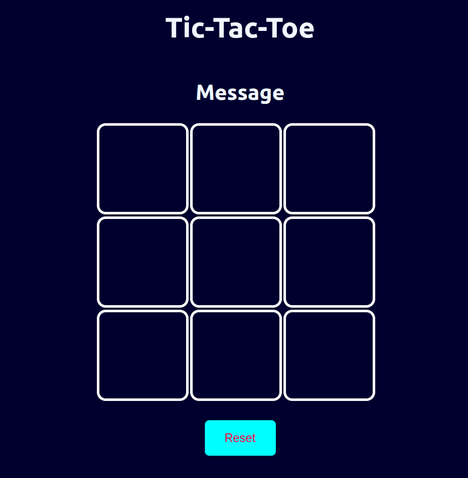

# Tic Tac Toe (XO)

# Technologies Used
1. HTML
2. CSS 
3. JavaScript

## Description
This is the classic XO game. Each person gets 1 turn. If you get 3 squares of the same value you win. 

## User Stories 
1. As a User, I want to see a 3x3 grid board.
2. As a User, I want to click on a square to place my X or O. 
3. As a user, I want to see if I win if I get 3 X's in a row
4. As a User, I want to see a tie message if no players wins.
5. As a User, I want to see a restart button and when I click it the game should reset. 

## ScreenShots
